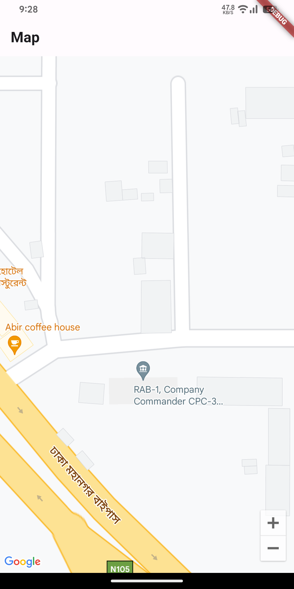

# flutter_google_maps

A new Flutter project.

## Getting Started

To get Google Map working follow those step

### Step 1: Enable the Google Maps API
1. Go to the [Google Cloud Console](https://console.cloud.google.com/).
2. Create or select a project for your Flutter application.
3. Navigate to the "APIs & Services" > "Dashboard" in the left sidebar.
4. Click on the "+ ENABLE APIS AND SERVICES" button.
5. Search for "Maps SDK for Android" and select it.
6. Click the "Enable" button to enable the Google Maps Android API.
7. If it requires payment just click back button multiple times and try again, it'll be enabled somehow (really confusing why it works)
### STEP 2: CREATE API KEY
1. From the Google Cloud Console, go to "APIs & Services" > "Credentials."
2. Click on the "+ CREATE CREDENTIALS" button and select "API key."
3. A new API key is generated. Click on the API key name to configure it.
### STEP 3: CONFIGURE API KEY FOR ANDROID
1. In the API key configuration page, scroll down to the "Key restriction" section.
2. Under "Application restrictions," select "Android apps."
3. Under "Package name," enter your Flutter application's package name.
4. Under "SHA-1 certificate fingerprint," enter the SHA-1 fingerprint of your debug or release keystore.
- To get the SHA-1 fingerprint for debug keystore:
  keytool -list -v -keystore ~/.android/debug.keystore -alias androiddebugkey -storepass android -keypass android
5. Click "Save" to save the changes.
### STEP 4: COPY API KEY
1. Copy the generated API key.
### STEP 5: ADD API KEY TO FLUTTER APPLICATION
1. Open your Flutter project.
2. Navigate to the `android/app/src/main/AndroidManifest.xml` file.
3. Add the following
   `<meta-data>` element inside the `<application>` element, replacing `YOUR_API_KEY` with the copied API key:
   <application>
<!-- ... other configurations ... -->
<meta-data
android:name="com.google.android.geo.API_KEY"
android:value="YOUR_API_KEY"/>
</application>
### STEP 6: RUN YOUR FLUTTER APPLICATION
1. Build and run your Flutter application.
   By following these steps, you should have successfully configured Google Maps in your Flutter application using the Google Cloud Console. Ensure that your API key is properly configured and added to your AndroidManifest.xml file to avoid any issues with Google Maps not loading.
