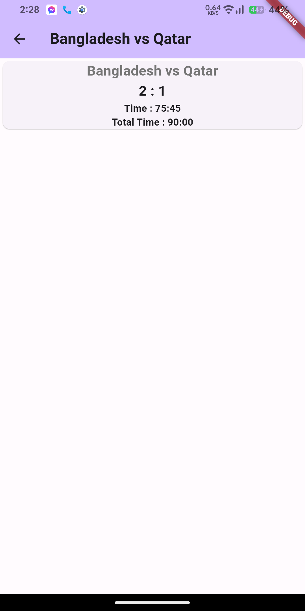

# Flutter Firebase এর অ্যাসাইনমেন্ট

# Notes:
To build the app in android. You need to enable "multiDexEnable". To resolve this use "flutter run" from terminal of the project folder.
# Description
Create a firebase flutter simple app which has 2 screens, one is ‘match list screen’ which shows the list of football matches (see the figure). And these matches are ‘post manually’ by you in your firebase database. (No need to write the post operation of the code).

After adding in the firebase match lists, then your main target is to ‘get data or get scores of specific matches which are tapped by the user’ from your firebase project. Which are shown in the 2nd / 3rd picture in the description.

For example : In your firebase there are 2 match lists added manually like (Arg vs Africa, Italy vs Spain). You can add more match lists whatever you want. And output will be 2 countries' match names (Arg vs Africa), number of goals (2 : 3), running time, (Total time : 90:00).

  
